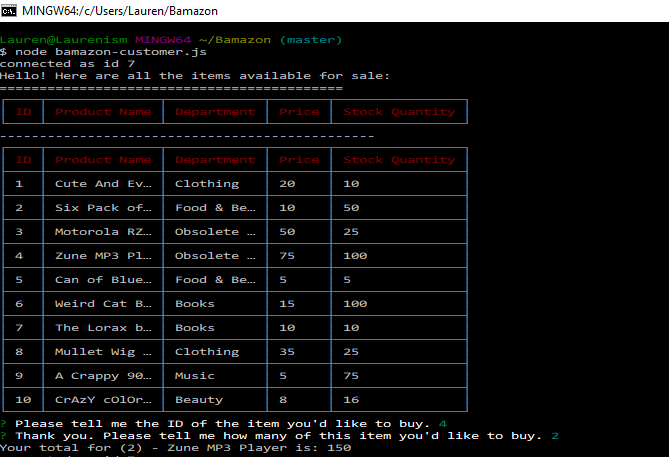

# Bamazon

### Overview

Bamazon is an interactive, text-based shopping application. It uses MySQL and NodeJS to allow users to purchase items as a customer. It will soon feature the ability to view, track and update the product inventory as a manager, and track the total sales by department as an executive.

### Customer View

The Bamazon Customer Portal allows users to view the current items available for purchase. The user will be prompted to enter the item id# and how many items they wish to purchase. If the item is in stock, the order will be completed and the user will see the total amount of their purchase.

### Technologies Used

Bamazon was built using Node.js, and runs specificallly in Node, using Node specific commands. 
It also utilizes MySQL as the database, in which inventory information is stored, updated, and deleted as "transactions" take place. 
NPM packages Inquirer, CLI-Table, and MySQL were used to ensure a smooth experience for both the user and the programmer.